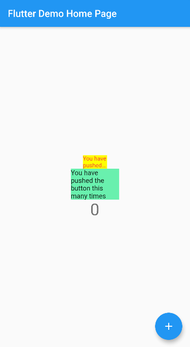

# Flutter Plugin PubDev

## Praktikum Menerapkan Plugin di Project Flutter

### Langkah 1 : Buat Project Baru

Membuat sebuah project flutter baru dengan nama **flutter_plugin_pubdev**. Lalu jadikan repository di GitHub dengan nama **flutter_plugin_pubdev**.

### Langkah 2 : Menambahkan Plugin 

Tambahkan plugin `auto_size_text` menggunakan perintah berikut di terminal

```
flutter pub add auto_size_text
```

Jika berhasil, maka akan tampil nama plugin beserta versinya di file `pubspec.yaml` pada bagian dependencies.

### Langkah 3 : Buat file red_text_widget.dart

Buat file baru bernama `red_text_widget.dart` di dalam folder lib lalu isi kode seperti berikut.

```
import 'package:flutter/material.dart';

class RedTextWidget extends StatelessWidget {
  const RedTextWidget({Key? key}) : super(key: key);

  @override
  Widget build(BuildContext context) {
    return Container();
  }
}
```

### Langkah 4 : Tambah Widget AutoSizeText

Masih di file `red_text_widget.dart`, untuk menggunakan plugin `auto_size_text`, ubahlah kode return `Container()` menjadi seperti berikut.

```
return AutoSizeText(
      text,
      style: const TextStyle(color: Colors.red, fontSize: 14),
      maxLines: 2,
      overflow: TextOverflow.ellipsis,
);
```

### Langkah 5 : Membuat Variable text dan parameter di constructor

Tambahkan variable `text` dan parameter di constructor seperti berikut.

```
final String text;

const RedTextWidget({Key? key, required this.text}) : super(key: key);
```

### Langkah 6 : Tambahkan widget di main.dart

Buka file `main.dart` lalu tambahkan di dalam `children:` pada `class _MyHomePageState`

```
Container(
   color: Colors.yellowAccent,
   width: 50,
   child: const RedTextWidget(
             text: 'You have pushed the button this many times:',
          ),
),
Container(
    color: Colors.greenAccent,
    width: 100,
    child: const Text(
           'You have pushed the button this many times:',
          ),
),
```
**Run** aplikasi tersebut dengan tekan **F5**, maka hasilnya akan seperti berikut.



## Tugas Praktikum 

1. Selesaikan Praktikum tersebut, lalu dokumentasikan dan push ke repository Anda berupa screenshot hasil pekerjaan beserta penjelasannya di file `README.md`!

2. Jelaskan maksud dari langkah 2 pada praktikum tersebut!

**Jawab :**

Maksud dari langkah tersebut adalah menambahkan plugin `auto_size_text` kedalam project flutter. 

3. Jelaskan maksud dari langkah 5 pada praktikum tersebut!

**Jawab :**

Maksud dari kode program tersebut adalah agar text yang digunakan dapat diubah secara dinamis pada komponen yang lainnya, dapat dilihat pada widget `AutoSizeText()` bagian baris pertama terdapat `text` yang belum memiliki nilai berupa String, jadi nilai tersebut didapatkan dari variable `text` pada parameter di constructornya. 

4. Pada langkah 6 terdapat dua widget yang ditambahkan, jelaskan fungsi dan perbedaannya!

**Jawab :**

Fungsi dari kedua widget tersebut adalah sama-sama untuk menampilkan text. Perbedaannya terletak pada pengunaannya, untuk yang widget pertama memanggil class `RedTextWidget` yang didalamnya terdapat parameter `text` untuk digunakan pada widget `AutoSizeText()`. Sedangkan untuk widget yang kedua, langsung memanggil widget `Text()` tanpa menggunakan plugin tambahan atau pemanggilan class yang lainnya. 

5. Jelaskan maksud dari tiap parameter yang ada di dalam plugin auto_size_text berdasarkan tautan pada dokumentasi https://pub.dev/documentation/auto_size_text/latest/ !

**Jawab :**

Penjelasan dari parameter tersebut antara lain sebagai berikut :

| Parameter     | Description   | 
| ------------- |:--------------| 
| `key`*     | Melakukan control bagaimana widget satu me-replace widget yang lain | 
| `textKey`    | Melakukan inisialisasi key sebagai hasil pada `Text` widget |
| `style`* | Melakukan styling pada text |   
| `minFontSize` | Font minimal yang digunakan text |
| `maxFontSize` | Font maksimal yang digunakan text |
| `stepGranularity` | Menentukan pengurangan size text pada tiap baris |
| `presetFontSizes` | Menentukan besarnya fontsize pada `minFontSize`, `maxFontSize` dan `stepGranularity` |
| `group` | Digunakan untuk sinkronisasi ukuran pada saat menggunakan multiple `AutoSizeText` |
| `textAlign`* | Digunakan sebagai perataan text |
| `textDirection`* | Menentukan arah text, seperti `TextAlign.start` dan `TextAlign.end`. |
| `locale`* | Digunakan untuk memilih font ketika karakter Unicode yang sama dapat dirender secara berbeda, tergantung pada lokal. |
| `softWrap`* | Menentukan breakline dari text |
| `wrapWords` | Jika kalimat tidak memuat pada satu baris, maka akan di wrap. |
| `overflow`* | Untuk memvisualisasikan text yang overflow |
| `overflowReplacement` | Untuk memvisualisasikan text yang overflow dengan mengganti dengan text atau widget yang lain. |
| `textScaleFactor`* | Intensitas dari font pixels. |
| `maxLines` | Batas maksimal baris text |
| `semanticsLable`* | Label semantik pada text |

6. Kumpulkan laporan praktikum Anda berupa link repository GitHub ke LMS!
 


